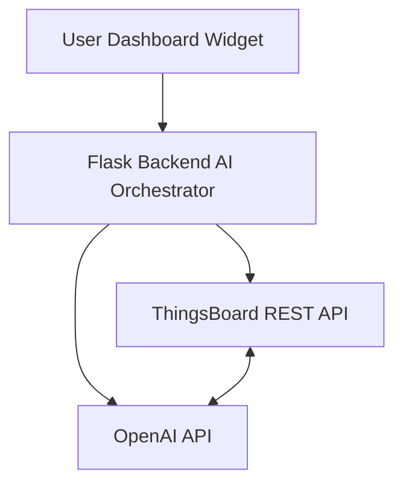

# 🤖 ThingsBoard AI Assistant
### Conversational Intelligence for IoT Dashboards

<p align="center">
  <strong>Turn your IoT dashboards into smart, conversational systems.</strong><br/>
  Ask questions. Visualize data. Get alerts. All in natural language.
</p>

---

## 🌌 What is ThingsBoard AI Assistant?

**ThingsBoard AI Assistant** is an AI-powered conversational layer designed to sit directly inside a ThingsBoard dashboard.

Instead of manually checking telemetry, attributes, and charts, users can simply **ask questions in plain English** and get:

- 📡 Real-time device status
- 📊 Auto-generated charts
- 🚨 Proactive alerts
- 🧠 Context-aware AI answers

All powered by **Flask + ThingsBoard REST APIs + OpenAI**.

---

## ✨ Key Features

### 💬 Conversational Device Intelligence
- Ask natural language questions about your devices
- AI responds strictly using **live ThingsBoard data**

### 📊 Smart Chart Generation
- Automatically detects when a chart is needed
- Fetches historical telemetry on demand
- Renders graphs dynamically using Chart.js

### 🚨 Proactive Alerts
- Detects critical conditions like:
  - 🔋 Low battery (<20%)
  - 🚨 Active alarms
- Displays alert banners in real time

### 🧩 Native ThingsBoard Integration
- Embedded via **Static HTML Widget**
- No plugin or core modification required

### 🎨 Modern UI
- Dark mode + glassmorphism
- Neon accents (Neural-Link inspired)
- Markdown-rendered AI responses
- Voice input support 🎙

---

## 🧠 High-Level Architecture



*(Note: If Mermaid diagrams are not supported in your viewer, the flow is: User → Flask Backend → ThingsBoard API & OpenAI API)*

### Technology Stack

| Layer | Tech |
| --- | --- |
| **Frontend** | HTML, CSS, JavaScript, Chart.js |
| **Backend** | Python, Flask |
| **AI Engine** | OpenAI GPT |
| **IoT Platform** | ThingsBoard |

---

## 📁 Project Structure

```text
tb-ai-assistant/
├── .github/
│   └── instructions/
│
├── things-bot/
│   ├── templates/
│   │   └── index.html          # AI Chat UI
│   ├── .env                    # Environment secrets (ignored)
│   ├── .env.example            # Sample env file
│   ├── app.py                  # Flask backend (main entry)
│   ├── dashboard_widget.html   # ThingsBoard embed widget
│   ├── tb_client.py            # ThingsBoard REST API wrapper
│   ├── requirements.txt        # Python dependencies
│   ├── debug_tb.py             # ThingsBoard debug utility
│   ├── debug_device_token.py   # Token troubleshooting
│   ├── debug_https.py          # HTTPS debugging
│   ├── verify_parser.py        # JSON parser validation
│   └── README.md               # Quickstart
│
└── .gitignore

```

---

## 🔄 Request → Response Flow

1. **User asks a question** in the chat widget
2. **Flask backend** receives the request (`/ask`)
3. **Latest telemetry & attributes** fetched from ThingsBoard
4. **Context is cleaned**, flattened & timestamp-normalized
5. **AI decides**:
* Text answer only ❓
* Or chart + explanation 📊


6. **OpenAI generates response** using **only provided data**
7. **Frontend renders**:
* AI answer
* Charts (if applicable)
* Alerts (if detected)


---

## 🧩 Core Components

### 🖥 Backend – `app.py`

**Role:** System Brain

* Context preparation
* Intent detection
* Alert evaluation
* AI orchestration

**Endpoints**

* `/ask` → Main AI interaction
* `/alerts` → Polls for critical states

---

### 🔌 ThingsBoard Client – `tb_client.py`

**Role:** Secure Data Gateway

**Capabilities**

* JWT authentication handling
* Latest telemetry fetch
* Attribute retrieval
* Historical data queries
* Dynamic key discovery

---

### 💬 Frontend – `index.html`

**Design:** Neural-Link inspired

**Features**

* Chat-style UI
* Markdown AI responses
* Dynamic Chart.js graphs
* Voice input support
* Real-time alert banner

---

### 🧩 Embedding – `dashboard_widget.html`

* Used inside ThingsBoard **Static HTML widget**
* Loads Flask UI via `<iframe>`
* Fully resizable and responsive

---

## ⚙️ Installation & Setup

### ✅ Prerequisites

* Python **3.8+**
* ThingsBoard (Cloud or Self-hosted)
* OpenAI API Key

---

### 📦 Installation

#### 1️⃣ Clone Repository

```bash
git clone [https://github.com/Itinerant18/ThingsBoard---Bot.git](https://github.com/Itinerant18/ThingsBoard---Bot.git)
cd ThingsBoard---Bot/things-bot

```

#### 2️⃣ Install Dependencies

```bash
pip install -r requirements.txt

```

#### 3️⃣ Configure Environment

Create a `.env` file in the `things-bot` directory:

```env
TB_URL="[https://thingsboard.cloud](https://thingsboard.cloud)"
TB_USER="your_email@example.com"
TB_PASSWORD="your_password_or_jwt"
DEVICE_ID="your_device_id"
OPENAI_API_KEY="sk-xxxxxxxx"

```

#### 4️⃣ Run the Application

```bash
python app.py

```

*🌐 Server runs at: `http://localhost:5000*`

#### 5️⃣ Test Connection

```bash
python debug_tb.py

```

#### 6️⃣ Embed into ThingsBoard

1. Open ThingsBoard Dashboard
2. Add **Static HTML Widget**
3. Paste contents of `dashboard_widget.html`
4. Save & resize

🎉 **AI Assistant is live!**

---

## 🗣 Example Queries

### Text

> “What is the current battery level?”
> “Is the device online?”
> “Show device configuration”

### Charts

> “Show battery trend”
> “Chart temperature history”

---

## 🔐 Security Notes

* `.env` file is never committed
* JWT tokens handled securely
* AI responses are context-limited (no hallucination)
* No device write access (read-only)

---

## ⚡ Performance

* Lightweight Flask backend
* Cached key discovery
* On-demand historical data fetching
* Minimal API calls

---

## 🛠 Troubleshooting

| Issue | Fix |
| --- | --- |
| **Login failed** | Check `.env` credentials / expired JWT |
| **No data** | Run `debug_tb.py`, verify permissions |
| **OpenAI error** | Check API key & credit |
| **Widget not loading** | Ensure `flask-cors` enabled |

---

## 🚀 Future Roadmap

* [ ] 🔄 Multi-device conversations
* [ ] 🧠 Local LLM (Ollama) support
* [ ] 📈 Predictive analytics
* [ ] 🗂 Conversation memory
* [ ] 👥 Role-based dashboard access


## 🌟 Final Thoughts

This project transforms static IoT dashboards into interactive AI assistants, making device monitoring faster, smarter, and more human.

If you like this project — ⭐ **star it, fork it, and build on it.**

Happy building 🚀

```

### Next Step
Since you are currently stuck on a `git push` error, you can save this content to your `README.md` file now, but remember you must resolve the git conflict (using **Option 1: Pull** or **Option 2: Force Push** from my previous message) before you can successfully upload this new README to GitHub.

```
